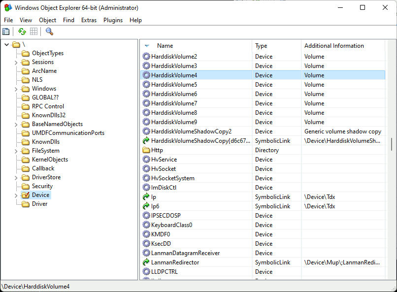
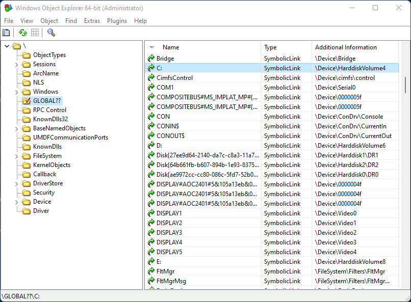

# NT Kernel

If everything in Unix is a file, then everything in NT is an object[^1]. And if that object is named then it can be accessed via the NT kernel's Object Manager.

For people using the Win32 APIs this is technically an implementation detail but, when it comes to file paths at least, it's a very leaky one. Understanding how paths are handled at this level will help understand Win32 paths as well.

[^1]: This isn't quite true for either.

## NT Paths

The kernel uses paths to query named objects in the object manager. These look similar to a UNIX path. For example:

    \Device\HarddiskVolume2

A path is made up of "components", separated by a `\`. Each component represents a directory name or a file name. In NT, components are arrays of [16-bit code units](Strings.md). Any character except `\` (`0x005C`) is allowed in component names. Even `NULL` (`0x0000`) is allowed.

Starting a path with a `\` indicates that it starts from the root. It's an absolute path.

### Relative paths

If a directory is opened, kernel APIs allow you to open sub paths based on that directory. For example if you open the directory:

    \Device\HarddiskVolume2\directory

You can then use the directory handle to open a relative path, such as:

    subdir\file.ext

So the absolute path of the file will be:

    \Device\HarddiskVolume2\directory\subdir\file.ext

This is the only type of relative path understood by the kernel. In the NT kernel `.` and `..` have no special meaning and can be regular files or directories (but almost certainly shouldn't be).

### Device paths

When resolving paths the Object Manager itself is actually only responsible for finding the devices it manages. You can see this using [WinObjEx64](https://github.com/hfiref0x/WinObjEx64). Note that in the path `\Device\HarddiskVolume4` is not a directory.

What happens is the Object Manager resolves the device path and then the rest of the path is given to the device to resolve itself. For example, given the path:

    \Device\HarddiskVolume2\directory\subdir\file.ext

The Object Manager will find `\Device\HarddiskVolume2` and pass it the path `\directory\subdir\file.ext` which the device may resolve to a resource. Alternatively the device can give a new path back to the Object Manager and ask it to "reparse" the path (i.e. discard the old path and resolve the new path).

In effect this means that devices are free to resolve paths however they like. However, filesystem drivers should usually stick to [filesystem conventions](Filesystems.md) even though this is not enforced by the kernel. If they do not then users of the Win32 APIs may be unable to properly use the filesystem.

## Object Manager Symlinks

Device paths such as `\Device\HarddiskVolume2` are all very well but often you want a more meaningful or consistent name. To this end NT supports symbolically linking from one path to another. Many of these meaningful names will be collected into a single NT folder: `\??`.

For example, to access a drive by its GUID you can use:

    \??\Volume{a2f2fe4e-fb6b-4442-9244-1342c61c4067}

Or you can use a friendly drive name:

    \??\C:

The `:` here has no special meaning. It's just part of the symlink name.

## The `\??` folder

The `\??` folder is not actually a normal directory. Instead it's a virtual folder that merges two directories:

* The `\GLOBAL??` directory. This contains symlinks common to all usesr. 
* A per-user `DosDevices` directory. This contains the user's symlinks so the exact path depends on the user. In the following image it's `\Sessions\0\DosDevices\00000000-00053ce2` 

## Security

Win32 paths such as:

    R:\path\to\file.ext

Will resolve to the NT path:

    \??\R:\path\to\file.ext

As `R:` is symlink, this means that there is a symlink at the root of the win32 path. Users do not need any special permission to add or remove symlinks (aka "Dos Devices"). The potential security implications are somewhat mitigated by the fact that users can only affect their own Dos Devices directory and not `\Global??` or that of other users. That said, paths are just strings so can easily cross user boundaries (e.g. when a process impersonates another user so it can carry out operations in the context of that user).
